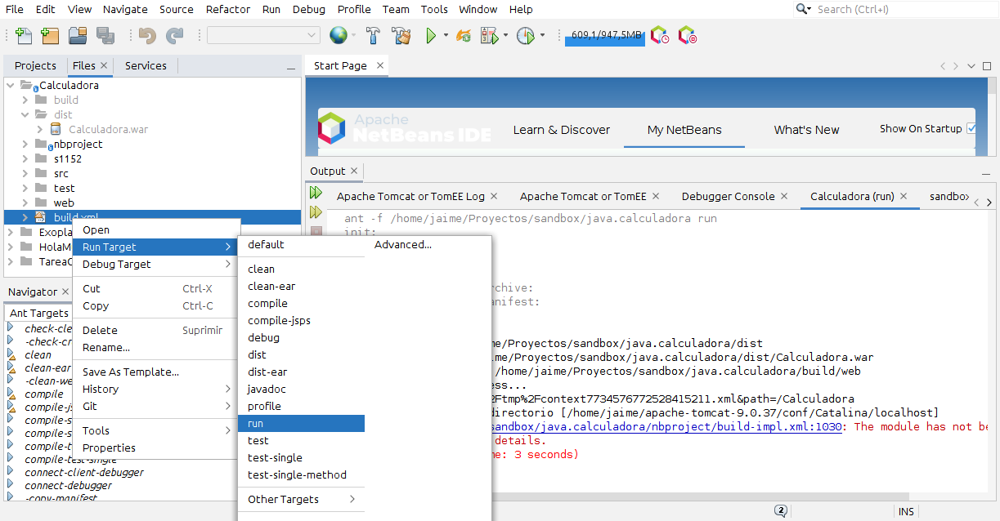
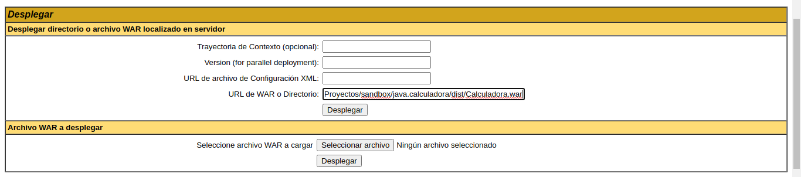

# Servidor de Aplicaciones Apache Tomcat

!!! info "Fuentes"
    - [Documentación de Apache Tomcat](https://tomcat.apache.org/tomcat-9.0-doc/index.html)

## Introducción

Apache Tomcat, o simplemente **Tomcat** es una administrador de *servlets*, una aplicación que permite gestionar y lanzar aplicaciones web.

!!! note "Terminología"
    - **Contexto**: una aplicación web
    - Otros términos están definidos en la [especificación Servlet y JSP](https://wiki.apache.org/tomcat/Specifications)

### Directorios y archivos

La estructura básica de carpetas de Tomcat es:

```sh
/home/usuario/apache-tomcat-9.0.xx # $CATALINA_HOME
├── bin/            # iniciar, apagar y otros scripts.
├── conf/           # archivos de configuración y DTD relacionados
│   ├── context.xml
│   ├── tomcat-users.xml
│   ├── web.xml
│   └── server.xml # config del contenedor
├── logs/           # archivos de registro (por defecto)
└── webapps/        # tus aplicaciones web
    ├── ejemplo-app/
    │   ├── archivos(.jsp, .css ...)
    │   ├── META-INF/
    │   │   └── context.xml
    .   └── WEB-INF/
    .       ├── classes/
            ├── lib/
            └── web.xml
```

### Comandos básicos

```sh
# Iniciar
$CATALINA_HOME/bin/startup.sh

# Detener
$CATALINA_HOME/bin/shutdown.sh

# Imprimir información sobre la versión etc
$CATALINA_HOME/bin/version.sh
```

### Configuración

=== "server.conf"
    ```xml
    <?xml version="1.0" encoding="UTF-8"?>
    <!-- Note:  A "Server" is not itself a "Container", so you may not
         define subcomponents such as "Valves" at this level.
         Documentation at /docs/config/server.html
     -->
    <Server port="8005" shutdown="SHUTDOWN">
      <Listener className="org.apache.catalina.startup.VersionLoggerListener" />
      <!-- Security listener. Documentation at /docs/config/listeners.html
      <Listener className="org.apache.catalina.security.SecurityListener" />
      -->
      <!--APR library loader. Documentation at /docs/apr.html -->
      <Listener className="org.apache.catalina.core.AprLifecycleListener" SSLEngine="on" />
      <!-- Prevent memory leaks due to use of particular java/javax APIs-->
      <Listener className="org.apache.catalina.core.JreMemoryLeakPreventionListener" />
      <Listener className="org.apache.catalina.mbeans.GlobalResourcesLifecycleListener" />
      <Listener className="org.apache.catalina.core.ThreadLocalLeakPreventionListener" />

      <!-- Global JNDI resources
           Documentation at /docs/jndi-resources-howto.html
      -->
      <GlobalNamingResources>
        <!-- Editable user database that can also be used by
             UserDatabaseRealm to authenticate users
        -->
        <Resource name="UserDatabase" auth="Container"
                  type="org.apache.catalina.UserDatabase"
                  description="User database that can be updated and saved"
                  factory="org.apache.catalina.users.MemoryUserDatabaseFactory"
                  pathname="conf/tomcat-users.xml" />
      </GlobalNamingResources>

      <!--  Un "Service" es una colección de uno o más "Connectors" que comparten
            un único contenedor.
            Un "Service" no es en sí mismo un "Container", de modo que NO PUEDES
            definir subcomponentes como "Valves" en este nivel
            Documentación en /docs/config/service.html
       -->
      <Service name="Catalina">

        <!-- Un "Connector" representa un punto final por el que se reciben peticiones
            y se devuelven respuestas.
             Documentación en :
             Java HTTP Connector: /docs/config/http.html
             Java AJP  Connector: /docs/config/ajp.html
             APR (HTTP/AJP) Connector: /docs/apr.html
             Define un Conector no-SSL/TLS HTTP/1.1 en el puerto 8080
        -->
        <Connector port="8080" protocol="HTTP/1.1"
                   connectionTimeout="20000"
                   redirectPort="8443" />
        <!-- Define un Conector SSL/TLS HTTP/1.1 en el puerto 8443 con
            configuración estilo JSSE
        -->
        <!--
        <Connector port="8443" protocol="org.apache.coyote.http11.Http11NioProtocol"
                   maxThreads="150" SSLEnabled="true">
            <SSLHostConfig>
                <Certificate certificateKeystoreFile="conf/localhost-rsa.jks"
                             type="RSA" />
            </SSLHostConfig>
        </Connector>
        -->
        <!-- Define un Conector SSL/TLS HTTP/1.1 en el puerto 8443 con HTTP/2
            configuración estilo OpenSSL
        -->
        <!--
        <Connector port="8443" protocol="org.apache.coyote.http11.Http11AprProtocol"
                   maxThreads="150" SSLEnabled="true" >
            <UpgradeProtocol className="org.apache.coyote.http2.Http2Protocol" />
            <SSLHostConfig>
                <Certificate certificateKeyFile="conf/localhost-rsa-key.pem"
                             certificateFile="conf/localhost-rsa-cert.pem"
                             certificateChainFile="conf/localhost-rsa-chain.pem"
                             type="RSA" />
            </SSLHostConfig>
        </Connector>
        -->

        <Engine name="Catalina" defaultHost="localhost">

          <Realm className="org.apache.catalina.realm.LockOutRealm">
            <Realm className="org.apache.catalina.realm.UserDatabaseRealm"
                   resourceName="UserDatabase"/>
          </Realm>

          <Host name="localhost"  appBase="webapps"
                unpackWARs="true" autoDeploy="true">

            <Valve className="org.apache.catalina.valves.AccessLogValve" directory="logs"
                   prefix="localhost_access_log" suffix=".txt"
                   pattern="%h %l %u %t &quot;%r&quot; %s %b" />

          </Host>
        </Engine>
      </Service>
    </Server>
    ```

=== "users.xml"
    ```xml
    <?xml version="1.0" encoding="UTF-8"?>
    <tomcat-users xmlns="http://tomcat.apache.org/xml"
                  xmlns:xsi="http://www.w3.org/2001/XMLSchema-instance"
                  xsi:schemaLocation="http://tomcat.apache.org/xml tomcat-users.xsd"
                  version="1.0">
    <!-- Roles necesarios para acceder a la interfaz web: manager-gui -->
      <role rolename="manager-gui"/>
      <role rolename="manager-script"/>
      <role rolename="rrhh"/>
      <user username="root" password="admin1234" roles="manager-gui,manager-script, rrhh"/>
    </tomcat-users>
    ```

## Desplegar una aplicación

Para Tomcat una _aplicación web_ es una **jerarquía de directorios y archivos**. Se puede acceder a ella _descomprimida_ o _empaquetada_ (archivo Web, _Web ARchive_ o **.war**).

El directorio en el nivel más alto de tu aplicación web representa la _raíz_ de la aplicación. Aquí es donde se colocan los achivos HTML y las páginas JSP de las que se compone la interfaz. Cuando una aplicación se _despliega_ el administrador del sistema asigna una _ruta contextual_ (o relativa) a tu aplicación. Por eso también se llama _Contextos_ a las aplicaciones.

!!! note "Ejemplo"
    Si tenemos una aplicación llamada "catálogo", desplegarla es, hablando rápido, asignarla una ruta `/catalog`, de forma que cuando escribamos en el navegador `/catalog/index.html` pueda encontrar el archivo `index.html` en la carpeta raíz de la aplicación.

### Contenidos típicos del directorio de aplicación
Para facilitar la creación del archivo `.war`, lo suyo es organizar los archivos "ejecutables" de la aplicación del mismo modo que lo hace el formato WAR:

- **Archivos `*.html`, `*.jsp`, etc.**: en la carpeta raíz.
- **`/WEB-INF/web.xml`**: el _descriptor de despliegue_. Un archivo XML que describe los componentes de tu aplicación, junto con los parámetros de inicialización necesarios y las restricciones de seguridad que quieres que aplique el servidor.
- **`/WEB-INF/classes`**: archivos de clases java (y recursos asociados) necesarios para que funcione la app.
- **`/WEB-INF/lib`**: Directorio con archivos JAR (librerías o controladores JDBC).

### Descriptor de despliegue (web.xml)

Es un archivo que describe y _define_ todo lo que el servidor necesita saber sobre tu aplicación (excepto la _ruta contextual_; eso lo asigna el administrador del sistema cuando se despliega la app).

!!! note "Reglas"
    Existe un DTD para el descriptor de despliegue, cuyas reglas hay que seguir. En particular **se deben** introducir los elementos (`<filter>`, `<servlet>` y `<servlet-mapping>`) _en el orden definido_ por el DTD.

#### Ejemplos

=== "Sencillo"
    ```xml
    <?xml version="1.0" encoding="UTF-8"?>
    <web-app version="3.1" xmlns="http//xmlns.jcp.org/xml/ns/javase">
        <!-- definiciones aquí -->
        
        <!-- Nombre y descripción del servicio -->
        <display-name>Ejemplo</display-name>
        <description>Descriptor web de ejemplo.</description>

        <!-- servlets java: esto es el "núcleo" de la aplicación -->
        <servlet>
            <servlet-name>HolaMundo</servlet-name>
            <!-- nombre del servlet que se ejecutará -->
            <servlet-servlets>package.ejemplo.HolaMundo</servlet-servlets>
        </servlet>
        <!-- rutas de acceso a las servlets -->
        <servlet-mapping>
            <servlet-name>HolaMundoServlet</servlet-name>
            <!-- ruta de acceso -->
            <url-pattern>/HolaMundoServlet</url-pattern>
        </servlet-mapping>

        <!-- opciones de control de sesión -->
        <session-config>
            <!-- la sesión se cierra tras 30 minutos de inactividad -->
            <session-timeout>30</session-timeout>
        </session-config>
        <!-- para probar el servlet, abrimos la dirección: http://{address}:{port}/{servletName} -->
    </web-app>
    ```

=== "host-manager"
    ```xml
    <?xml version="1.0" encoding="UTF-8"?>
    <web-app xmlns="http://xmlns.jcp.org/xml/ns/javaee"
      xmlns:xsi="http://www.w3.org/2001/XMLSchema-instance"
      xsi:schemaLocation="http://xmlns.jcp.org/xml/ns/javaee
                          http://xmlns.jcp.org/xml/ns/javaee/web-app_4_0.xsd"
      version="4.0"
      metadata-complete="true">

      <display-name>Tomcat Host Manager Application</display-name>
      <description>
        A scriptable host management web application for the Tomcat Web Server;
        Manager lets you view, create and remove virtual hosts.
      </description>

      <request-character-encoding>UTF-8</request-character-encoding>

      <servlet>
        <servlet-name>HostManager</servlet-name>
        <servlet-class>org.apache.catalina.manager.host.HostManagerServlet</servlet-class>
        <init-param>
          <param-name>debug</param-name>
          <param-value>2</param-value>
        </init-param>
      </servlet>
      <servlet>
        <servlet-name>HTMLHostManager</servlet-name>
        <servlet-class>org.apache.catalina.manager.host.HTMLHostManagerServlet</servlet-class>
        <init-param>
          <param-name>debug</param-name>
          <param-value>2</param-value>
        </init-param>
      </servlet>

      <!-- ... -->

      <!-- Restricciones de seguridad -->
      <security-constraint>
        <!-- recursos o "área" sobre la que se aplica esta restricción -->
        <web-resource-collection>
          <web-resource-name>HostManager commands</web-resource-name>
          <url-pattern>/text/*</url-pattern>
        </web-resource-collection>
        <!-- roles o grupos que tienen acceso a los recursos -->
        <auth-constraint>
           <role-name>admin-script</role-name>
        </auth-constraint>
      </security-constraint>

      <!-- ... -->

      <!-- Configuración de login -->
      <login-config>
        <auth-method>BASIC</auth-method>
        <realm-name>Tomcat Host Manager Application</realm-name>
      </login-config>

      <!-- roles de seguridad utilizados en esta aplicación -->
      <security-role>
        <description>
          The role that is required to log in to the Host Manager Application HTML
          interface
        </description>
        <role-name>admin-gui</role-name>
      </security-role>

      <security-role>
        <description>
          The role that is required to log in to the Host Manager Application text
          interface
        </description>
        <role-name>admin-script</role-name>
      </security-role>

      <!-- Mensajes de error -->
      <error-page>
        <error-code>401</error-code>
        <location>/WEB-INF/jsp/401.jsp</location>
      </error-page>
      <error-page>
        <error-code>403</error-code>
        <location>/WEB-INF/jsp/403.jsp</location>
      </error-page>
      <error-page>
        <error-code>404</error-code>
        <location>/WEB-INF/jsp/404.jsp</location>
      </error-page>

    </web-app>
    ```

=== "Extenso"
    ```xml
    <?xml version="1.0" encoding="UTF-8"?>
    <!-- Licencia
      Licensed to the Apache Software Foundation (ASF) ... 
    -->

    <!DOCTYPE web-app
        PUBLIC "-//Sun Microsystems, Inc.//DTD Web Application 2.3//EN"
        "http://java.sun.com/dtd/web-app_2_3.dtd">

    <web-app>


        <!-- Descripción general de la aplicación -->

        <display-name>My Web Application</display-name>
        <description>
          This is version X.X of an application to perform
          a wild and wonderful task, based on servlets and
          JSP pages.  It was written by Dave Developer
          (dave@mycompany.com), who should be contacted for
          more information.
        </description>


        <!-- Parámetros de inicialización de contexto que definen
            constantes de tipo String compartidas y usadas dentro
            de tu aplicación, que pueden ser personalizadas por el
            administrador del sistema que la instale.
            Los valores reales asignados a estos parámetros se pue-
            den recuperar en un servlet o página JSP llamando a:

                 String value =
                   getServletContext().getInitParameter("nombre");

            donde "nombre" coincide con el elemento <param-name>
            de uno de los parámetros de inicialización.

            Puedes definir tantos parámetros de inicialización como
            quieras, o ninguno
        -->

        <context-param>
          <param-name>webmaster</param-name>
          <param-value>myaddress@mycompany.com</param-value>
          <description>
            The EMAIL address of the administrator to whom questions
            and comments about this application should be addressed.
          </description>
        </context-param>


        <!-- Definiciones del servlet para los servlets que componen
            tu aplicación web, incluyendo parámetros de inicialización.
            Con Tomcat puedes también mandar peticiones a servlets que
            no estén listados aquí:

               http://localhost:8080/{context-path}/servlet/{classname}

            pero no es seguro que funcione si portas tu apliación. Por
            otra parte, complica innecesariamente establecer las rutas
            relativas a imágenes u otros recursos de tu aplicación.
            Se recomienda definir todos tus servlets y la ruta hacia
            ellos con un elemento servlet-mapping.

            Los valores reales asignados a estos parámetros se pue-
            den recuperar en un servlet o página JSP llamando a:

                 String value =
                   getServletContext().getInitParameter("nombre");

            donde "nombre" coincide con el elemento <param-name>
            de uno de los parámetros de inicialización.

            Puedes definir tantos parámetros de inicialización como
            quieras, o ninguno
        -->

        <servlet>
          <servlet-name>controller</servlet-name>
          <description>
            This servlet plays the "controller" role in the MVC architecture
            used in this application.  It is generally mapped to the ".do"
            filename extension with a servlet-mapping element, and all form
            submits in the app will be submitted to a request URI like
            "saveCustomer.do", which will therefore be mapped to this servlet.

            The initialization parameter names for this servlet are the
            "servlet path" that will be received by this servlet (after the
            filename extension is removed).  The corresponding value is the
            name of the action class that will be used to process this request.
          </description>
          <servlet-class>com.mycompany.mypackage.ControllerServlet</servlet-class>
          <init-param>
            <param-name>listOrders</param-name>
            <param-value>com.mycompany.myactions.ListOrdersAction</param-value>
          </init-param>
          <init-param>
            <param-name>saveCustomer</param-name>
            <param-value>com.mycompany.myactions.SaveCustomerAction</param-value>
          </init-param>
          <!-- Carga este servlet cuando arranque el servidor -->
          <load-on-startup>5</load-on-startup>
        </servlet>

        <servlet>
          <servlet-name>graph</servlet-name>
          <description>
            This servlet produces GIF images that are dynamically generated
            graphs, based on the input parameters included on the request.
            It is generally mapped to a specific request URI like "/graph".
          </description>
        </servlet>


        <!-- Define las rutas o "mapeos" que usará el contenedor del servlet
            para traducir una petición URI concreta (relativa a la ruta del
            contexto) hacia un servlet en particular.
            Los ejemplos siguientes se corresponden a la definición de los
            servlets de arriba.

            Si tenemos una petición URI como esta:

               http://localhost:8080/{contextpath}/graph

            se mapeará hacia el servlet "graph", mientras que esta petición:

               http://localhost:8080/{contextpath}/saveCustomer.do

            se mapeará hacia el servlet "controller"

            Puedes definir tantos mapeos como quieras, o ninguno.
            También se puede definir más de un mapeo para un mismo servlet.
        -->

        <servlet-mapping>
          <servlet-name>controller</servlet-name>
          <url-pattern>*.do</url-pattern>
        </servlet-mapping>

        <servlet-mapping>
          <servlet-name>graph</servlet-name>
          <url-pattern>/graph</url-pattern>
        </servlet-mapping>


        <!-- Define en minutos el tiempo por defecto que pasará para cerrar 
            automáticamente sesión.
            Desde un servlet o página JSP puedes modificar este valor dinámicamente
            usando: 

            HttpSession.getMaxInactiveInterval(). -->

        <session-config>
          <session-timeout>30</session-timeout>    <!-- 30 minutos -->
        </session-config>


    </web-app>
    ```
    
### Descriptor de contexto (context.xml)

Opcionalmente se pueden añadir opciones de configuración en `/META-INF/context.xml`:

- log de acceso
- fuentes de datos
- configuración del administrador de sesiones
- etc.

Debe contener **un elemento `<Context>`** que se considerará hijo del elemento `<Host>` en el que se está desplegando la aplicación.

### Formas de desplegar una aplicación

Una aplicación debe estar desplegada en un contenedor servlet para que pueda ejecutarse. Esto puede hacerse de varias maneras

=== "Manual (directorio)"
    Copia el directorio de tu aplicación (incluyendo los directorios mencionados antes) como un subdirectorio dentro de `$CATALINA_HOME/webapps/`. Asegúrate de reiniciar Tomcat después de instalar o actualizar tu aplicación.

=== "Manual (war)"
    Copia el archivo WAR dentro de `$CATALINA_HOME/webapps/`. Tomcat se encargará de descomprimirlo luego.

    !!! note "Actualización"
        Para actualizar tu app de este modo, debes reemplazar el archivo WAR **Y TAMBIÉN** borrar el directorio expandido que Tomcat había creado, y finalmente reiniciar Tomcat.

    !!! info "Generar un archivo war"

    === "Por consola"
        ```sh
        jar cf ejemplo.war -C ruta_a_version_expandida
        ```
    === "Con netbeans"
        - Buscamos el archivo `build.xml` desde la pestaña de archivos del proyecto.
        - Ejecutamos `run target`y a continuación `run`
        - Se creará una carpeta `dist` dentro del proyecto, que contendrá el archivo WAR.
        
        

=== "Administrador (Tomcat manager)"
    Usa las opciones del administrador web de Tomcat para subir un archivo war o indicar ruta al directorio de la aplicación. Se accede desde la interfaz web de Tomcat, ruta `/manager`; requiere un usuario con el rol `manager-gui`.

    

Otros son un poco más avanzados:

=== "Ant"
    Utilizando algunas definiciones de tareas personalizadas para la herramienta [Ant](http://ant.apache.org/manual/tasksoverview.html) que permiten automatizar la ejecución de comandos en la aplicación web "Manager".

=== "Desplegador Tomcat"
    Tomcat incluye una herramienta empaquetada con las tareas Ant, y puede usarse para precompilar archivos JSP automáticamente antes de desplegar una app en el servidor
