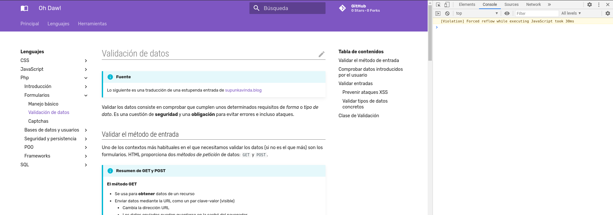
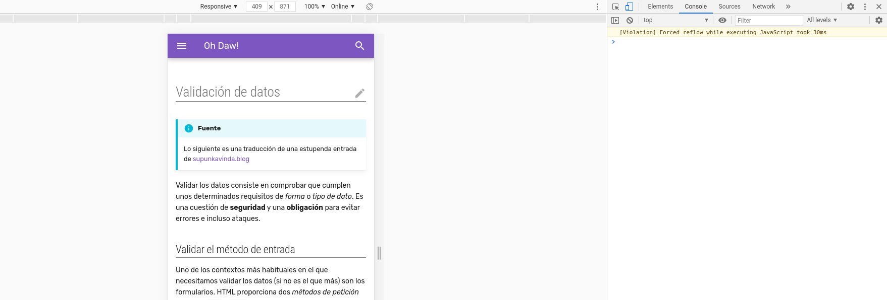
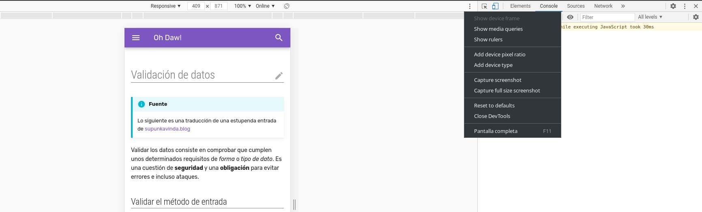

# Diseño web responsivo

!!! info "Fuente"
    Esto es un resumen del curso de Udacity [Responsive Web Design Fundamentals](https://www.udacity.com/course/responsive-web-design-fundamentals--ud893)

## 1.Introducción

Hablamos de diseño _responsivo_ cuando el aspecto de una página cambia **adaptándose** a las características de diferentes **dispositivos**, en especial, a la **resolución de pantalla**.

### Herramientas de desarrollo

No tiene sentido ni suele ser posible probar _físicamente_ nuestro diseño en diferentes dispositivos; en lugar de eso podemos **emular** otras resoluciones de pantalla en el propio navegador para ver cómo quedaría nuestra web. Para ello usamos las **Herramientas de desarrollo**.

=== "Acceso rápido"

- Google Chrome: ++ctrl+shift+j++
- Vivaldi: ++f12++

=== "Dev Tools"
    
=== "Dispositivos"
    
    
    Para habilitar la vista _responsiva_ hacemos click en el icono de la esquina superior izquierda. Alternativamente podemos pulsar ++ctrl+shift+m++ (con las herramientas abiertas).

=== "Menú"
    
    
    En el menú desplegable aparecen las resoluciones de algunos modelos ya predefinidas.

=== "Opciones"
    
    
    Podemos marcar opciones adicionales, como la **densidad de pixeles**, importante si trabajamos con dispositivos que tengan _retina display_.

## 2.Lo pequeño primero

Para facilitar el diseño de aplicaciones que se vean bien en diferentes resoluciones hay que empezar por el dispositivo más pequeño. A este modo de trabajo se lo conoce también como diseño _mobile first_ (móvil primero).

### Viewport

El _viewport_ es la parte de la pantalla en la que el navegador puede mostrar contenido. Es una **medida relativa** puesto que varía en función del tamaño del navegador y de la _densidad de píxeles_ del dispositivo.

!!! note "Píxeles"
    Cuando usamos píxeles como unidad de medida en diseño web, tenemos que distinguir entre **píxeles de hardware** y **píxeles independientes** (_device independent pixels_ o DIP).

    Los navegadores indican el ancho que ocupan en dips y no en píxeles de hardware. La razón es que los dips indican una _distancia_ real, independiente de la densidad de píxeles del dispositivo en cuestión. De esta forma se facilita la compatibilidad del código entre varios dispositivos.

### Fijar una escala

Cuando no se especifica un tamaño para el viewport, el navegador asume un tamaño fijo para el contenido y trata de ajustarlo como puede, dando lugar a resultados...desastrosos a veces. Uno de los recursos utilizados es el _font boosting_: aumentar ligeramente el tamaño de letra de ciertos elementos HTML.

Para establecer el viewport se usa una etiqueta HTML:

```html
<meta name="viewport" content="width=device-width, initial-scale=1">
```

### Tamaños relativos

Uno de los principios del diseño responsivo es **evitar el scrolling lateral**. Una forma simple de atacar el tema es crear una regla CSS que ajuste el _ancho máximo_ de los elementos que pueden salirse del marco:

```css
img, embed, object, video {
    max-width: 100%;
}
```

Las medidas deben darse siempre (o siempre que se pueda) en **unidades relativas**:

- _Porcentaje_: relativo a la medida del **contenedor**.
- _em_: medida relativa al tamaño de fuente heredado del contenedor
- _rem_: relativa al tamaño de fuente del elemento raíz (`<html>`)
- _vw_ y _vh_: relativas al tamaño del **viewport**

!!! note "Tap targets"
    Cualquier cosa que pueda ser _pulsable_ con los **dedos** debe tener al menos **40x40px** de tamaño.

### Ejemplo

=== "html"
    ```html
    <!doctype html>
    <html lang="en">
      <head>
        <meta name="viewport" content="width=device-width, initial-scale=1.0">
        <meta charset="utf-8">
        <meta http-equiv="X-UA-Compatible" content="IE=edge">
        <title>Brighton Times</title>
        <link href="https://fonts.googleapis.com/css?family=Roboto:300,400,500" rel="stylesheet" type="text/css">
        <link rel="stylesheet" type="text/css" href="main.css">
      </head>
      <body>

        <header class="header">
          <div class="header__inner">
            
            <h1 class="header__title">
              The Brighton Times
            </h1>
          </div>
        </header>

        <nav id="drawer" class="nav">
          <ul class="nav__list">
            <li class="nav__item"><a href="#">News</a></li>
            <li class="nav__item"><a href="#">Events</a></li>
            <li class="nav__item"><a href="#">Culture</a></li>
            <li class="nav__item"><a href="#">Blog</a></li>
          </ul>
        </nav>

        <main>
          <section class="content">
            <section class="hero">
              <article class="description">
                <h2>Absolutely astonishing breaking news!</h2>
                <p>Organic raw denim Vice keffiyeh lomo Kickstarter art lomo Kickstarter art four loko. Organic raw denim Vice keffiyeh lomo Kickstarter art lomo Kickstarter art four loko.</p>
              </article>
            </section>

            <section class="news top-news">
              <h2 class="news__title">Top news <a href="#" class="news__more">+ more</a></h2>
              <ul>
                <li class="top-news__item">
                  <a href="#">Gastropub distillery Marfa farm-to-table, Etsy Truffaut fingerstache.</a>
                </li>
                <li class="top-news__item">
                  <a href="#">Squid lomo Kickstarter art lomo Kickstarter art party cronut scenester.</a>
                </li>
                <li class="top-news__item">
                  <a href="#">Organic raw denim lomo Kickstarter art Vice keffiyeh four loko.</a>
                </li>
                <li class="top-news__item">
                  <a href="#">Organic raw denim Vice keffiyeh lomo Kickstarter art lomo Kickstarter art four loko.</a>
                </li>
              </ul>
            </section>

            <section class="scores">
              <table class="scores__table">
                <thead>
                  <tr>
                    <th>date</th>
                    <th>team</th>
                    <th colspan="2">score</th>
                    <th>team</th>
                  </tr>
                </thead>
                <tbody>
                  <tr>
                    <td>Friday</td>
                    <td>Bears</td>
                    <td>95</td>
                    <td class="winner">109</td>
                    <td class="winner">Cubs</td>
                  </tr>
                  <tr>
                    <td>Friday</td>
                    <td class="winner">Otters</td>
                    <td class="winner">3</td>
                    <td>1</td>
                    <td>Cubs</td>
                  </tr>
                  <tr>
                    <td>Saturday</td>
                    <td class="winner">Wolves</td>
                    <td class="winner">7</td>
                    <td>0</td>
                    <td>Panthers</td>
                  </tr>
                  <tr>
                    <td>Sunday</td>
                    <td>Hawks</td>
                    <td>11</td>
                    <td class="winner">12</td>
                    <td class="winner">Capons</td>
                  </tr>
                  <tr>
                    <td>Sunday</td>
                    <td class="winner">Stags</td>
                    <td class="winner">6</td>
                    <td>2</td>
                    <td>Foxes</td>
                  </tr>
                  
                </tbody>
              </table>
            </section>

            <section class="weather">
              <span class="weather__location">Brighton, UK</span>
              <span class="weather__desc">Sunny</span>
              <span class="weather__today">
              <span class="weather__today__temp">13</span><span class="weather__today__deg">&deg;C</span>
              </span>
              <ul class="weather__next">
                <li class="weather__next__item">
                  <span>Mon</span>
                  
                  <span>13 &deg;C</span>
                </li><li class="weather__next__item">
                  <span>Tues</span>
                  
                  <span>13 &deg;C</span>
                </li><li class="weather__next__item">
                  <span>Wed</span>
                  
                  <span>13 &deg;C</span>
                </li><li class="weather__next__item">
                  <span>Thu</span>
                  
                  <span>13 &deg;C</span>
                </li><li class="weather__next__item">
                  <span>Fri</span>
                  
                  <span>13 &deg;C</span>
                </li>
              </ul>
            </section>

            <section class="news recent-news">
              <h2 class="news__title">Latest news <a href="#" class="news__more">+ more</a></h2>
              <ul>
                <li class="snippet">
                  
                  <h3 class="snippet__title"><a href="#">Gastropub distillery Marfa farm-to-table</a></h3>
                  <p>Gastropub distillery Marfa farm-to-table, Etsy Truffaut fingerstache.
                  Squid lomo Kickstarter art party cronut scenester. Organic raw denim Vice keffiyeh four loko. Squid lomo Kickstarter art party cronut scenester. Organic raw denim Vice keffiyeh four loko.Vice keffiyeh four loko. Squid lomo Kickstarter art party cronut scenester. Organic raw denim Vice keffiyeh four loko.Vice keffiyeh four loko. Squid lomo Kickstarter art party cronut scenester. Organic raw denim Vice keffiyeh four loko.
                  </p>
                </li>
                <li class="snippet">
                  
                  <h3 class="snippet__title"><a href="#">Organic raw keffiyeh four loko.</a></h3>
                  <p>Vice keffiyeh four loko. Squid lomo Kickstarter art party cronut scenester. Organic raw denim Vice keffiyeh four loko.Vice keffiyeh four loko. Squid lomo Kickstarter art party cronut scenester. Organic raw denim Vice loko.
                  </p>
                </li>
                <li class="snippet">
                  
                  <h3 class="snippet__title"><a href="#">Kickstarter art party cronut scenester.</a></h3>
                  <p>Gastropub distillery Marfa farm-to-table, Etsy Truffaut fingerstache.
                  Squid lomo Kickstarter art party cronut scenester. Organic raw denim Vice keffiyeh four loko. Squid lomo Kickstarter art party cronut scenester. Organic raw denim Vice keffiyeh four loko.Vice keffiyeh four loko.
                  </p>
                </li>
                <li class="snippet">
                  
                  <h3 class="snippet__title"><a href="#">Squid lomo Kickstarter art party cronut </a></h3>
                  <p>Gastropub distillery Marfa farm-to-table, Etsy Truffaut fingerstache.
                  Squid lomo Kickstarter art party cronut scenester. Organic raw denim Vice keffiyeh four loko. Squid lomo Kickstarter art party cronut scenester. Organic raw denim Vice keffiyeh four loko.Vice keffiyeh four loko.
                  </p>
                </li>
              </ul>
            </section>
          </section>
          <footer>
            <ul>
              <li><a href="#">Contact us</a></li>
              <li><a href="#">Follow us on Twitter</a></li>
              <li><a href="#">RSS</a></li>
            </ul>
          </footer>
        </main>
      </body>
    </html>
    ```
    
=== "css"
    ```css
    body, html {
      margin: 0;
      padding: 0;
      width: 100%;
      height: 100%;
    }

    body {
      font-family: Roboto;
      font-size: 12px;
      color: #424242;
    }

    h1, h2, h3, h4, h5 {
      margin: 0; 
    }

    header, nav, footer, section, article, div {
      box-sizing: border-box;
    }

    ul {
      list-style: none;
      padding: 0;
      margin: 0;
    }


    /*
     *
     * Common
     * 
     */

    .news__more {
      float: right;
      font-size: .8em;
      color: #333;
      text-decoration: none;
    }


    /*
     *
     * Header
     *
     */

    .header {
      box-shadow: 0 2px 5px rgba(0, 0, 0, 0.26);
      min-height: 56px;
      transition: min-height 0.3s;
    }

    .header__inner {
      width: 800px;
      margin-left: auto;
      margin-right: auto;
    }

    .header__logo {
      height: 72px;
      margin-right: 1em;
      vertical-align: top;
      margin-top: 12px;
    }

    .header__title {
      font-weight: 300;
      font-size: 4em;
      margin: 0.5em 0.25em;
      display: inline-block;
      color: #212121;
    }


    /*
     *
     * Top Level Navigation
     *
     */

    .nav {
      width: 100%;
      margin-left: auto;
      margin-right: auto;
    }

    .nav__list {
      width: 100%;
      padding: 0;
      margin: 0;
    }

    .nav__item {
      box-sizing: border-box;
      display: inline-block;
      width: 24%;
      text-align: center;
      line-height: 24px;
      padding: 24px;
      text-transform: uppercase;
    }

    .nav a {
      text-decoration: none;
      color: #616161;
      padding: 1.5em;
    }

    .nav a:hover {
      text-decoration: underline;
      color: #212121;
    }


    /*
     *
     * Main
     *
     */

    main {
      box-shadow: 0 2px 5px rgba(0, 0, 0, 0.26);
      width:100%;
      margin-left: auto;
      margin-right: auto;
    }

    /*
     *
     * Content
     *
     */


    /*
     *
     * Hero
     *
     */

    .hero {
      width: 100%;
      position: relative;
      background-image: url("./images/dog.jpg");
      background-size: cover;
      height: 300px;
    }

    .hero article {
      box-sizing: border-box;
      background-color: #000;
      background-color: rgba(0, 0, 0, 0.7);
      position: absolute;
      bottom: 0;
      height: 40%;
      width: 100%;
      color: #fff;
      padding: 1em;
    }


    /*
     *
     * Top News
     *
     */

    .top-news {
      height: 300px;
      border-bottom: 1px solid #E0E0E0;
      padding: 1em;
    }

    .news__title {
      font-weight: 300;
      border-bottom: 1px solid #E0E0E0;
      line-height: 24px;
      font-size: 16px;
    }

    .top-news__item {
      border-bottom: 1px solid #E0E0E0;
      padding: 1em 0;
      line-height: 19.2px;
    }

    .top-news__item:before {
      content: "» ";
    }

    .top-news__item:last-child {
      border-bottom: none;
    }

    .top-news__item a {
      text-decoration: none;
      color: #666;
      padding-top: 1.5em;
      padding-bottom: 1.5em;
    }

    .top-news__item a:hover,
    .top-news__item a:active {
      text-decoration: underline;
    }


    /*
     *
     * Sport Scores
     *
     */

    .scores {
      padding-top: 1em;
    }

    .scores__table {
      width: 100%;
      border-collapse: collapse;
    }

    .scores__table th,
    .scores__table td {
      padding: 1em; 
    }

    .scores__table th {
      color: #fff;
      font-weight: 300;
      background-color: #78909C;
    }

    .scores__table tr:nth-child(odd) td {
      background-color: #fff;
    }

    .scores__table tr:nth-child(even) td {
      background-color: #eceff1;
    }

    .scores__table td.winner {
      font-weight: bold;
    }

    .scores__table td:nth-child(3) {
      text-align: right;
    }

    .scores__table td:nth-child(2),
    .scores__table td:nth-child(5) {
      text-align: center;
    }

    /*
     *
     * Weather
     *
     */

    .weather {
      padding: 1em;
    }

    .weather__location {
      display: block;
      font-weight: 300;
      font-size: 1.5em;
    }

    .weather__desc {
      display: block;
      font-size: 1.2em;
    }

    .weather__today {
      width: 60%;
      vertical-align: middle;
    }

    .weather__today__image {
      vertical-align: middle
    }

    .weather__today__temp {
      font-size: 3em;
    }

    .weather__today__deg {
      font-size: 2em;
      display: inline;
    }

    .weather__next__item {
      display: inline-block;
      width: 20%;
      text-align: center;
    }

    .weather__next__item span {
      display: block;
    }

    .weather__next__image {
      width: 100%;
    }


    /*
     *
     * Weather
     *
     */

    .recent-news {
      clear: both;
      padding: 1em;
    }

    .snippet {
      clear: both;
      margin: 24px 0;
    }

    .snippet__thumbnail {
      width: 100px;
      float: left;
      margin-right: 1em;
    }

    .snippet__title {
      font-weight: 500;
    }

    .snippet__title a {
      text-decoration: none;
      color: #666;
      padding-top: 1.5em;
      padding-bottom:1.5em;
    }

    .snippet__title a:hover,
    .snippet__title a:active {
      text-decoration: underline;
    }


    /*
     *
     * Footer
     *
     */

    footer {
      border-top: 1px solid #E0E0E0;
      padding: 1em;
      width: 100%;
    }

    footer li {
      display: inline-block;
      margin: 0 1em;
    }

    footer a {
      text-decoration: none;
      color: #333;
      padding: 1.5em;
    }
    ```

## 3.Estructurar la página

### Breakpoints y media-queries
### Grids
### Flexbox

## 4.Patrones responsivos

### Column Drop
### Mostly Fluid
### Layour Shifter
### Off Canvas

## 5.Optimización

### Imágenes
### Tablas
### Tipografías
### Breakpoints menores
