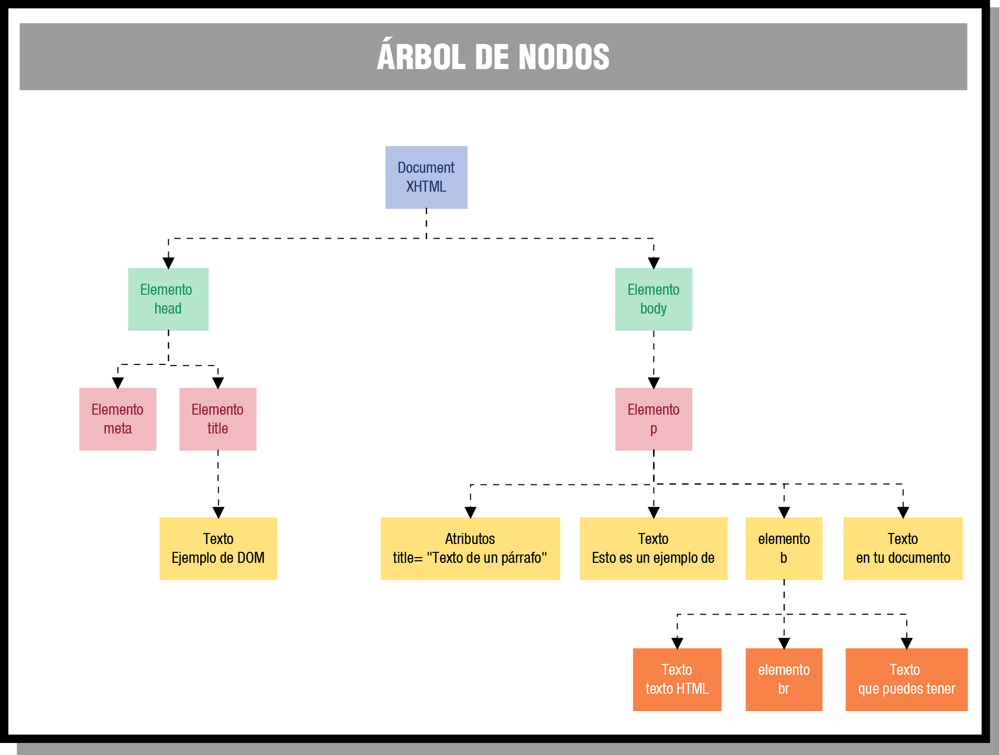

# Formas de manipular el DOM con JavaScript

DOM es un acrónimo de _Domain Object Model_, una interfaz de objetos que representan la estructura de un documento HTML o XML, definida, actualizada y mantenida por el [W3C](https://dom.spec.whatwg.org).

## Objetos del DOM HTML

- Document
- HTMLElement
- Anchor
- Area
- Base
- Body
- Button
- Event
- Form
- Frame/IFrame
- Frameset
- Image
- Input Button
- Input Checkbox
- Input File
- Input Hidden
- Input Password
- Input Radio
- Input Reset
- Input Submit
- Input Text
- Link
- Meta
- Object
- Option
- Select
- Style
- Table
- TableCell
- TableRow
- Textarea

## Nodos

El DOM transforma todos los documentos XHTML en un conjunto de elementos, a los que llama **nodos**, cada uno de los cuales es un **objeto**. Estos nodos están conectados entre sí y representan los contenidos de la página web, y la relación que hay entre ellos.

Cuando unimos todos estos nodos de forma jerárquica, obtenemos una estructura similar a un árbol, por lo que muchas veces se suele referenciar como **árbol DOM**

=== "html"
    ```html
    <!DOCTYPE html PUBLIC "-//W3C//DTD XHTML 1.0 Transitional//EN" "http://www.w3.org/TR/xhtml1/DTD/xhtml1ransitional.dtd">
    <html xmlns="http://www.w3.org/1999/xhtml">
        <head>
            <meta http-equiv="Content-Type" content="text/html; charset=utf-8" />
            <title>Ejemplo de DOM</title>
        </head>
        <body>
            <p title="Texto de un párrafo">Esto es un ejemplo de <b>texto HTML<br>
            que puedes tener</b> en tu documento.</p>
        </body>
    </html>
    ```
=== "árbol DOM"
    

### Tipos de nodos

Generalmente se trabaja con los siguientes

- **Document**: nodo raíz
- **Element**: cada etiqueta html.
    - contiene _atributos_
    - puede contener _otros elementos_
- **Attr**: atributos de etiquetas html
- **Text**: texto dentro de una etiqueta
- **Comment**: comentarios

Otros nodos son:

- **CdataSection**
- **DocumentFragment**
- **DocumentType**
- **EntityReference**
- **Entity**
- **Notation**
- **ProcessingInstruction**

### Acceso

#### Elementos

Se puede acceder a los nodos del DOM mediante varios **métodos**:

=== "getElement..."
    ```javascript
    // acceso directo a UN elemento
    document.getElementById(id);
    // acceso a colecciones de elementos
    document.getElementsByName(name);
    document.getElementsByTagName(etiqueta);
    document.getElementsByClassName(clase1 clase2 clasen);
    ```
=== "querySelector"
    ```javascript
    // acceso directo a UN elemento
    document.querySelector("#id");
    // acceso a colecciones de elementos
    document.querySelectorAll("etiqueta[name='valor']");
    document.querySelectorAll("etiqueta");
    document.querySelectorAll(".clase1 .clase2 .clasen");
    ```

#### Atributos

Si tenemos un elemento como:

```html
<input type="text" id="apellidos" name="apellidos"/>
```

=== "Acceder"
    ```javascript
    let apellidos = document.getElementById("apellidos");
    // por posición
    apellidos.attributes[0];
    // por clave
    apellidos.attributes["type"];
    // directo
    apellidos.type;
    // con get()
    apellidos.getAttribute('type');
    ```
=== "Cambiar"
    ```javascript
    let apellidos = document.getElementById("apellidos");
    // tipo
    // por posición / clave
    apellidos.attributes[0].nodeValue="password";
    apellidos.attributes["type"].nodeValue="password";
    // asignación directa
    apellidos.type = "password";
    // método set()
    apellidos.setAttribute('type', 'password'),
    ```
=== "Crear"
    ```javascript
    let apellidos = document.getElementById("apellidos");
    
    // con set(); si no existe, lo crea
    apellidos.setAttribute('value', 'Gómez Pérez');
    ```
=== "Eliminar"
    ```javascript
    let apellidos = document.getElementById("apellidos");
    
    // con set(); si no existe, lo crea
    apellidos.removeAttribute('value');
    ```

#### Nodos hijo

Para acceder a otros nodos descendientes del actual, se utiliza:

- `childNodes[n]`: _colección_ con todos los hijos
- `firstChild`: primer hijo
- `lastChild`: último hijo

### Crear y borrar nodos

Para añadir o eliminar nodos se usan los **métodos**:

- `createElement()`
- `createTextNode()`
- `appendChild()`

Si tenemos el siguiente elemento:

```html
<p title="Texto de un párrafo" id="parrafito">Esto es un ejemplo de <b>texto HTML<br />
que puedes tener</b> en tu documento.</p>
```

=== "Ejemplo 1"
    ```javascript
    let elemento = document.getElementById('parrafito');
    let nuevoParrafo = document.createElement('p');
    let nuevoTexto = document.createTextNode('Texto añadido al párrafo');

    // añadimos el texto al párrafo
    nuevoParrafo.appendChild(nuevoTexto);
    // añadimos el nuevo párrafo al elemento
    elemento.appendChild(nuevoParrafo);
    ```
=== "Ejemplo 1"
    ```javascript
    //Creamos tres elementos nuevos: p, b, br
    let elementoP = document.createElement('p');
    let elementoB = document.createElement('b');
    let elementoBR = document.createElement('br');
     
    //Le asignamos un nuevo atributo title al elementoP que hemos creado.
    elementoP.setAttribute('title','Parrafo creado desde JavaScript');
     
    //Preparamos los nodos de texto
    let texto1 = document.createTextNode('Con JavaScript se ');
    let texto2 = document.createTextNode('pueden realizar ');
    let texto3 = document.createTextNode('un monton');
    let texto4 = document.createTextNode(' de cosas sobre el documento.');
     
    //Añadimos al elemento B los nodos de texto2, elemento BR y texto3.
    elementoB.appendChild(texto2);
    elementoB.appendChild(elementoBR);
    elementoB.appendChild(texto3);
     
    //Añadimos al elemento P los nodos de texto1, elemento B y texto 4.
    elementoP.appendChild(texto1);
    elementoP.appendChild(elementoB);
    elementoP.appendChild(texto4);
     
    //insertamos el nuevo párrafo como un nuevo hijo de nuestro párrafo
    document.getElementById('parrafito').appendChild(elementoP);
    ```

### Resumen: propiedades

| Propiedad         | Valor     | Descripción                                                         |
|-------------------|-----------|---------------------------------------------------------------------|
| `nodeName`        | `String`  | Varía según el tipo de nodo.                                        |
| `nodeValue`       | `String`  | Varía según el tipo de nodo.                                        |
| `nodeType`        | `Integer` | Constante que representa cada tipo.                                 |
| `parentNode`      | `Object`  | Referencia al siguiente contenedor más externo.                     |
| `childNodes`      | `Array`   | Todos los nodos hijos en orden.                                     |
| `firstChild`      | `Object`  | Referencia al primer nodo hijo.                                     |
| `lastChild`       | `Object`  | Referencia al último nodo hijo.                                     |
| `previousSibling` | `Object`  | Referencia al hermano anterior según su orden en el código fuente.  |
| `nextSibling`     | `Object`  | Referencia al hermano siguiente según su orden en el código fuente. |
| `attributes`      | `NodeMap` | Array de atributos de los nodos.                                    |
| `ownerDocument`   | `Object`  | Contiene el objeto `document`.                                      |
| `namespaceURI`    | `String`  | URI a la definición de namespace.                                   |
| `Prefix`          | `String`  | Prefijo del `namespace`.                                            |
| `localName`       | `String`  | Aplicable a los nodos afectados en el `namespace`.                  |
| `innerHTML`       | `String`  | Modifica el html de los elementos hijo.                             |

### Resumen: métodos

| Método                          | Descripción                                                            |
|---------------------------------|------------------------------------------------------------------------|
| `appendChild(newChild)`         | Añade un hijo al final del nodo actual.                                |
| `cloneNode(deep)`               | Realiza una copia del nodo actual (opcionalmente con todos sus hijos). |
| `hasChildNodes()`               | Determina si el nodo actual tiene o no hijos (valor boolean).          |
| `insertBefore(new, ref)`        | Inserta un nuevo hijo antes de otro hijo.                              |
| `removeChild(old)`              | Borra un hijo.                                                         |
| `replaceChild(new, old)`        | Reemplaza un hijo viejo con el nuevo viejo.                            |
