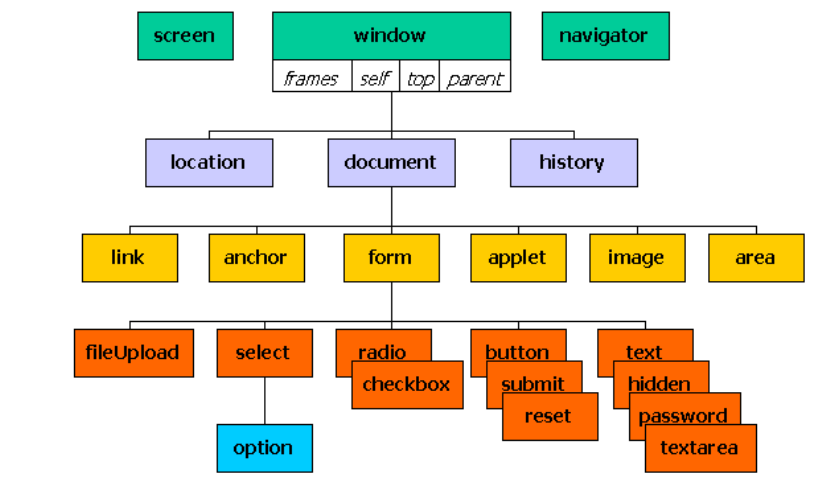

# Objetos en JavaScript
Un objeto es una _colección_ de:

- **propiedades** o valores
- **métodos** o funciones
- **eventos** o acciones

Excepto en el último punto es muy similar a cualquier otro lenguaje POO, como java.

!!! note "Acceso"
    Para acceder a una propiedad o método se usa el punto `.`:

    ```javascript
    Objeto.propiedad;
    Objeto.método([argumentos]);
    ```

!!! info "Jerarquía de Objetos en JavaScript"
    

Se puede crear un objeto vacío de **dos maneras**:

```javascript
let user = new Object(); // sintaxis de "Constructor"
let user = {};           // sintaxis de "Objeto Literal"
```
## Objetos literales

